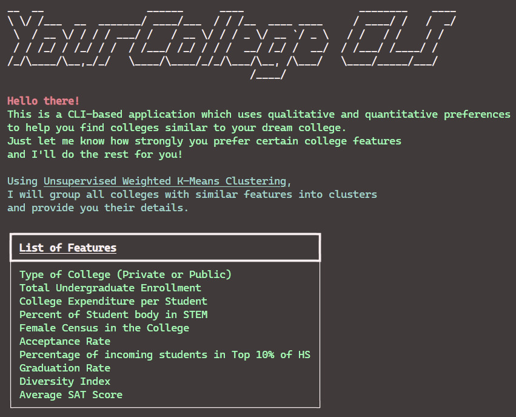

# YourCollege CLI


## What is it?
This is a CLI college recommender application that takes into consideration a users preferences about a college (both quantitative and qualitative aspects are considered) before suggesting a list of closely related colleges for you. 

## How it works?
We have made use of <b>Unsupervised Weighted K-Means Algorithm</b> to classify the master list of colleges into 40 different clusters based on the similarity of colleges. 

## Data Set
We have collected data sets about the different colleges in the U.S, their acceptance details, racial distribution, gender ratio, academic requirements and many others. 
- https://www.kaggle.com/datasets/jessemostipak/college-tuition-diversity-and-pay/versions/2?resource=download
- https://www.kaggle.com/datasets/yashgpt/us-college-data
- https://nces.ed.gov/ipeds/use-the-data

## How to Run
To execute the CLI application, ensure you have pip package manager installed. Then install the provided `requirements.txt` file using:
```terminal
pip install -r requirements.txt
```
Run the `cli.py` file in the source directory.